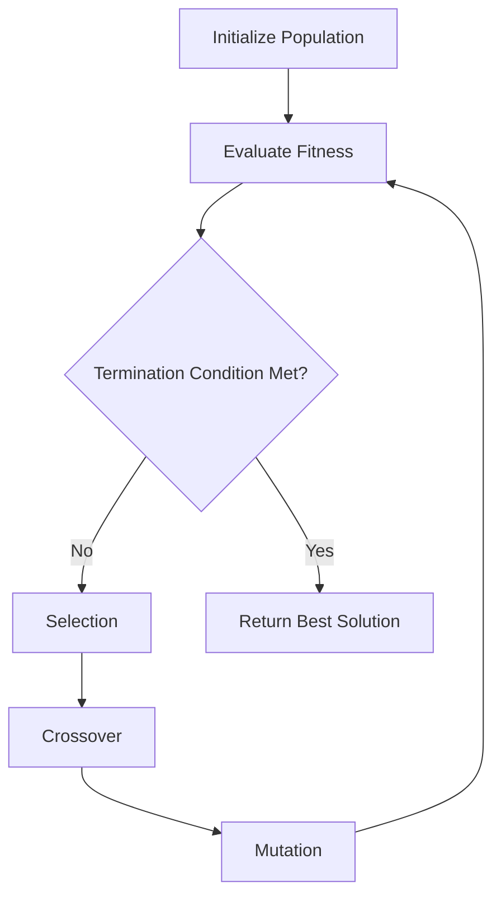
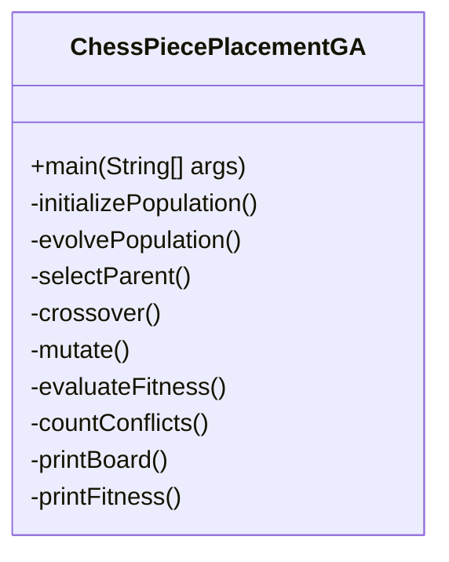

# Chess Piece Placement Genetic Algorithm: Mastering the Art of Evolutionary Optimization

<p align="center">
  
</p>

## Table of Contents
- [Chess Piece Placement Genetic Algorithm: Mastering the Art of Evolutionary Optimization](#chess-piece-placement-genetic-algorithm-mastering-the-art-of-evolutionary-optimization)
  - [Table of Contents](#table-of-contents)
  - [Overview: Unveiling the Power of Genetic Algorithms](#overview-unveiling-the-power-of-genetic-algorithms)
  - [Problem Statement: A Chess Puzzle for the Ages](#problem-statement-a-chess-puzzle-for-the-ages)
  - [Genetic Algorithm Approach: Nature-Inspired Problem Solving](#genetic-algorithm-approach-nature-inspired-problem-solving)
  - [Features: A Toolbox of Evolutionary Marvels](#features-a-toolbox-of-evolutionary-marvels)
  - [Prerequisites: Gearing Up for Genetic Exploration](#prerequisites-gearing-up-for-genetic-exploration)
  - [Installation and Usage: Your Gateway to Evolutionary Problem Solving](#installation-and-usage-your-gateway-to-evolutionary-problem-solving)
  - [Code Structure: The Blueprint of Evolution](#code-structure-the-blueprint-of-evolution)
  - [Algorithm Details: Decoding the Genetic Puzzle](#algorithm-details-decoding-the-genetic-puzzle)
  - [Configuration: Tailoring Evolution to Your Needs](#configuration-tailoring-evolution-to-your-needs)
  - [Output Explanation: Interpreting the Voice of Evolution](#output-explanation-interpreting-the-voice-of-evolution)
  - [Performance Considerations: Optimizing the Evolutionary Process](#performance-considerations-optimizing-the-evolutionary-process)
  - [Limitations and Future Improvements: Evolving the Evolution](#limitations-and-future-improvements-evolving-the-evolution)
  - [Contributing: Join the Evolutionary Revolution](#contributing-join-the-evolutionary-revolution)
  - [License: Open Source, Open Evolution](#license-open-source-open-evolution)

---

## Overview: Unveiling the Power of Genetic Algorithms

Welcome to the fascinating world of Genetic Algorithms (GA) applied to chess piece placement! This project is not just a simple implementation; it's a journey into the realm of computational intelligence, where we harness the power of evolution to solve complex optimization problems.

Our Chess Piece Placement GA tackles the intricate challenge of arranging multiple chess pieces on an 8x8 chessboard with minimal conflicts. Through the magic of evolutionary algorithms, we navigate a vast search space to find optimal or near-optimal solutions.

**Why is this project captivating?**
- It showcases the awe-inspiring capability of evolutionary algorithms in conquering complex optimization challenges.
- It beautifully intertwines elements of chess strategy with cutting-edge computational problem-solving techniques.
- The solution opens doors to practical applications in game design, AI training, and mind-bending puzzle creation.

Prepare to be amazed as you witness the evolution of chessboard configurations, generation by generation!

---

## Problem Statement: A Chess Puzzle for the Ages

Imagine a chessboard, not set up for a game, but as a puzzle of epic proportions. Your mission, should you choose to accept it, is to place 4 Queens, 2 Rooks, 2 Bishops, and 2 Knights on an 8x8 chessboard. But here's the twist – you must arrange them in such a way that the number of conflicts (pieces threatening each other) is minimized.

This isn't just any puzzle; it's a combinatorial optimization problem of staggering complexity. The search space is so vast that traditional methods would take eons to solve it. This is where our Genetic Algorithm steps in, ready to evolve solutions at lightning speed!

**Visualize the challenge:**
```
┌───┬───┬───┬───┬───┬───┬───┬───┐
│ Q │   │ B │   │   │ R │   │   │
├───┼───┼───┼───┼───┼───┼───┼───┤
│   │   │   │ K │   │   │   │ Q │
├───┼───┼───┼───┼───┼───┼───┼───┤
│   │ R │   │   │   │   │ B │   │
├───┼───┼───┼───┼───┼───┼───┼───┤
│   │   │   │   │ Q │   │   │   │
├───┼───┼───┼───┼───┼───┼───┼───┤
│ K │   │   │   │   │   │ Q │   │
├───┼───┼───┼───┼───┼───┼───┼───┤
│   │   │   │   │   │   │   │   │
├───┼───┼───┼───┼───┼───┼───┼───┤
│   │   │   │   │   │   │   │   │
├───┼───┼───┼───┼───┼───┼───┼───┤
│   │   │   │   │   │   │   │   │
└───┴───┴───┴───┴───┴───┴───┴───┘
```
(Note: This configuration is just the beginning. Your GA will evolve far superior solutions!)

---

## Genetic Algorithm Approach: Nature-Inspired Problem Solving

Prepare to be enthralled by the elegance of Genetic Algorithms – a problem-solving technique that mirrors the breathtaking process of natural selection. Our GA doesn't just solve problems; it evolves solutions through a fascinating journey of digital genetics.

Here's how the magic unfolds:

1. **Population Initialization**: We begin with a diverse population of potential solutions, each representing a unique chessboard configuration.

2. **Fitness Evaluation**: Each solution is assessed based on its fitness – in our case, the fewer conflicts between pieces, the fitter the individual.

3. **Selection**: The fittest individuals are chosen to become parents, mimicking the "survival of the fittest" principle in nature.

4. **Crossover**: Parent solutions combine their "genetic material" (board configurations) to create offspring, introducing new potential solutions.

5. **Mutation**: Random changes are introduced to maintain genetic diversity and explore new possibilities in the solution space.

6. **Evolution**: This process repeats over multiple generations, gradually improving the population's overall fitness.

**Witness the evolutionary process:**


As you run the algorithm, you'll witness the awe-inspiring spectacle of solutions evolving, conflicts diminishing, and order emerging from chaos – all through the power of computational evolution!

---

## Features: A Toolbox of Evolutionary Marvels

Our Chess Piece Placement Genetic Algorithm is not just a program; it's a comprehensive suite of evolutionary tools designed to tackle complex optimization problems. Behold the array of features at your disposal:

- 🧬 **Genetic Algorithm Core**: A robust implementation that brings the power of evolutionary computation to chess piece placement.
- 🔧 **Flexible Configuration**: Tailor the evolution process with adjustable parameters for generations and population size.
- ♟️ **Multi-Piece Support**: Seamlessly handle a variety of chess pieces including Queens, Rooks, Bishops, and Knights.
- 📊 **Advanced Fitness Evaluation**: A sophisticated conflict detection system that forms the backbone of our evolutionary process.
- 🔀 **Genetic Operators**: Cutting-edge crossover and mutation operations that drive the evolution of board configurations.
- 🖼️ **Visual Solution Representation**: Witness the best evolved solution come to life with a clear, visual board representation.
- 🔬 **Generation-by-Generation Analysis**: Track the progress of evolution with detailed fitness information for each generation.
- 🧠 **Intelligent Initialization**: Start with a smart initial population that respects piece distribution constraints.

Harness these features to not just solve the chess piece placement problem, but to gain deep insights into the fascinating world of evolutionary algorithms!

---

## Prerequisites: Gearing Up for Genetic Exploration

Before you embark on your evolutionary journey, ensure you're equipped with the following:

- **Java Development Kit (JDK) 8+**: The foundation of our genetic experiments. [Download JDK](https://www.oracle.com/java/technologies/javase-jdk11-downloads.html)
- **Java IDE** (Optional but recommended): 
  - [IntelliJ IDEA](https://www.jetbrains.com/idea/download/): A powerful IDE for an enhanced coding experience.
  - [Eclipse](https://www.eclipse.org/downloads/): A versatile alternative for Java development.
- **Command-line proficiency**: For those who prefer the raw power of the terminal.

With these tools at your disposal, you're ready to dive into the world of genetic algorithms and chess piece optimization!

---

## Installation and Usage: Your Gateway to Evolutionary Problem Solving

Embark on your journey into evolutionary computation with these simple steps:

1. **Clone the Repository**: 
   ```bash
   git clone https://github.com/your-repo/chess-piece-placement-ga.git
   cd chess-piece-placement-ga
   ```

2. **Compile the Java File**:
   ```bash
   javac ChessPiecePlacementGA.java
   ```

3. **Run the Program**:
   ```bash
   java ChessPiecePlacementGA
   ```

4. **Engage with the Evolution**:
   - Enter the number of generations to evolve your solutions.
   - Specify the population size for each generation.

5. **Witness Evolution in Action**: 
   - Watch as the program displays fitness scores for each chromosome across generations.
   - Marvel at the best solution evolved, visualized as a chessboard configuration.

**Example Interaction**:
```
Enter the number of generations: 100
Enter the population size: 50

Generation 1:
Chromosome 1 fitness: 0.125
Chromosome 2 fitness: 0.143
...
Best solution found:
Q . . R . B . .
. . . . Q . . R
B . . . . . K .
. Q . . . . . .
. . . . . K . .
. . Q . . . . B
. . . . R . . .
. . . Q . . . .

Fitness: 0.833
```

Prepare to be amazed as you witness the power of evolution solving complex chess piece placements before your very eyes!

---

## Code Structure: The Blueprint of Evolution

Dive into the architecture of our evolutionary masterpiece. The `ChessPiecePlacementGA` class is the heart of our genetic algorithm, embodying the essence of computational evolution:

- `main`: The command center, orchestrating the entire evolutionary process.
- `initializePopulation`: The genesis of our digital gene pool, creating the initial set of diverse solutions.
- `evolvePopulation`: The engine of evolution, driving the transformation of solutions across generations.
- `selectParent`, `crossover`, `mutate`: The genetic operators, mimicking nature's tools for creating and diversifying life.
- `evaluateFitness`, `countConflicts`: The arbiters of survival, determining the worthiness of each solution.
- `printBoard`, `printFitness`: The chroniclers of evolution, revealing the progress and results of our genetic journey.

**Behold the structure of our evolutionary algorithm:**


This elegant structure encapsulates the entire lifecycle of our genetic algorithm, from the birth of the initial population to the emergence of optimized solutions.

---

## Algorithm Details: Decoding the Genetic Puzzle

Unravel the intricacies of our genetic algorithm, a digital homage to the principles of natural selection:

1. **Chromosome Encoding**: 
   - Each solution is a char array of 64 elements, representing the 8x8 chessboard.
   - Pieces are encoded as: 'Q' (Queen), 'R' (Rook), 'B' (Bishop), 'K' (Knight), 'E' (Empty).

2. **Population Initialization**: 
   - A diverse initial population is created, respecting the constraints on piece numbers.
   - Each chromosome is a unique, randomly generated board configuration.

3. **Fitness Evaluation**: 
   - Fitness = 1 / (1 + number of conflicts)
   - Conflicts are meticulously counted based on chess movement rules for each piece.

4. **Selection**: 
   - Parents are chosen randomly from the population, with a bias towards fitter individuals.

5. **Crossover**: 
   - Uniform crossover with a CROSSOVER_RATE probability of gene inheritance from each parent.

6. **Mutation**: 
   - Each gene has a MUTATION_RATE chance of randomly changing to a different piece or empty square.

7. **Termination**: 
   - The algorithm evolves solutions for a user-specified number of generations.

This intricate dance of digital genetics drives the evolution of increasingly optimal chess piece placements, demonstrating the power of computational evolution in solving complex problems.

---

## Configuration: Tailoring Evolution to Your Needs

Harness the full power of evolution by fine-tuning these key parameters in the `ChessPiecePlacementGA` class:

```java
public static final int BOARD_SIZE = 8;
public static final int NUM_QUEENS = 4;
public static final int NUM_ROOKS = 2;
public static final int NUM_BISHOPS = 2;
public static final int NUM_KNIGHTS = 2;
public static final double MUTATION_RATE = 0.1;
public static final double CROSSOVER_RATE = 0.8;
```

- `BOARD_SIZE`: Adapt the algorithm for different chessboard dimensions.
- `NUM_QUEENS`, `NUM_ROOKS`, `NUM_BISHOPS`, `NUM_KNIGHTS`: Experiment with various piece combinations.
- `MUTATION_RATE`: Control the frequency of random changes in chromosomes.
- `CROSSOVER_RATE`: Adjust the balance between exploration and exploitation in the genetic process.

Tweak these parameters to observe how they influence the evolutionary process and the quality of solutions. The power to shape evolution is in your hands!

---

## Output Explanation: Interpreting the Voice of Evolution

As you run the algorithm, you'll witness the unfolding story of evolution through two key outputs:

1. **Generation-by-Generation Fitness Scores**:
   - For each generation, you'll see the fitness of every chromosome in the population.
   - Fitness ranges from 0 to 1, with 1 representing the holy grail – a perfect, conflict-free solution.
   - Watch how these scores generally improve over generations, showcasing evolution in action.

2. **Best Solution Visualization**:
   - The cream of the evolutionary crop – the best solution found – is displayed as a chessboard.
   - Piece representations:
     - 'Q': Queen - the most powerful piece, a true evolutionary success.
     - 'R': Rook - the straightforward strategist of our genetic pool.
     - 'B': Bishop - the diagonal thinker in our evolutionary tale.
     - 'K': Knight - the unpredictable jumper, adding spice to our genetic diversity.
     - 'E': Empty square - the breathing space in our evolved solution.

**Sample Output Interpretation**:
```
Best solution found:
E K E R Q E B E
B E E E E Q E R
E E E E E E K E
Q E E E E E E E
E E E Q E E E E
E Q E E E E E B
E E E E E B E E
E E K E R E E E

Fitness: 0.9523809523809523
```

This output showcases a highly evolved solution with minimal conflicts, demonstrating the power of genetic algorithms in solving complex placement problems.

---

## Performance Considerations: Optimizing the Evolutionary Process

As we delve into the realm of genetic algorithms, it's crucial to understand the performance implications and how to optimize our evolutionary journey:

- **Time Complexity**: O(G * P * N^2)
  - G: Number of generations
  - P: Population size
  - N: Board size
  This complexity arises from evaluating each chromosome in every generation.

- **Space Complexity**: O(P * N^2)
  - P: Population size
  - N: Board size
  We store the entire population of board configurations in memory.

**Optimization Strategies:**
1. **Bitboard Representation**: Implement bitboards for lightning-fast conflict checking.
2. **Parallel Fitness Evaluation**: Harness multi-core processors to evaluate fitness in parallel.
3. **Adaptive Rates**: Dynamically adjust mutation and crossover rates based on population diversity.
4. **Caching**: Store and reuse fitness values for unchanged portions of chromosomes.
5. **Early Termination**: Stop evolution if an optimal solution is found before reaching max generations.

By implementing these optimizations, you can dramatically speed up the evolutionary process, allowing for larger populations and more generations, potentially leading to even better solutions!

---

## Limitations and Future Improvements: Evolving the Evolution

While our Chess Piece Placement Genetic Algorithm is a powerful tool, it's important to recognize its current limitations and exciting opportunities for future enhancements:

**Current Limitations:**
1. **Local Optima**: The algorithm may sometimes converge on suboptimal solutions.
2. **Randomness**: Results can vary between runs due to the stochastic nature of genetic algorithms.
3. **Simple Selection**: The current random parent selection method may not be optimal for all scenarios.

**Thrilling Future Improvements:**
1. **Advanced Selection Methods**: 
   - Implement tournament selection for more strategic parent choices.
   - Explore roulette wheel selection to balance exploration and exploitation.

2. **Adaptive Parameters**:
   - Develop self-adjusting mutation and crossover rates based on population diversity.
   - Implement simulated annealing-inspired cooling schedules for parameter adjustment.

3. **Multi-Objective Optimization**:
   - Extend the algorithm to balance multiple objectives (e.g., minimize conflicts while maximizing board coverage).

4. **Hybridization**:
   - Combine GA with local search methods for a memetic algorithm approach.
   - Integrate machine learning techniques to guide the evolutionary process.

5. **Parallelization and Distribution**:
   - Implement island model GA for distributed computing environments.
   - Leverage GPU acceleration for fitness evaluation and genetic operations.

6. **Interactive Evolution**:
   - Develop a GUI allowing users to intervene in the evolutionary process.
   - Implement human-guided selection to incorporate domain expertise.

7. **Extensibility**:
   - Create a modular framework to easily swap different genetic operators and strategies.
   - Support various board sizes and custom piece sets for broader applicability.

By addressing these limitations and incorporating these exciting improvements, we can evolve our algorithm into an even more powerful and versatile tool for solving complex optimization problems!

---

## Contributing: Join the Evolutionary Revolution

Your contributions can help shape the future of evolutionary computation! We welcome fellow enthusiasts, researchers, and developers to join our quest for optimizing chess piece placement and beyond.

**How to Contribute:**
1. **Fork the Repository**: Create your own copy of the project to work on.
2. **Create a Feature Branch**: `git checkout -b feature/AmazingFeature`
3. **Commit Your Changes**: `git commit -m 'Add some AmazingFeature'`
4. **Push to the Branch**: `git push origin feature/AmazingFeature`
5. **Open a Pull Request**: Submit your changes for review and integration.

**Areas for Contribution:**
- Implement new selection methods or genetic operators
- Optimize performance for large-scale problems
- Develop visualization tools for the evolutionary process
- Extend the algorithm to solve related combinatorial problems
- Improve documentation and create tutorials
- Write unit tests to ensure robustness

Remember, every contribution, no matter how small, is valuable in the grand tapestry of evolutionary computation!

---

## License: Open Source, Open Evolution

This Chess Piece Placement Genetic Algorithm is proudly open-source, released under the [MIT License](https://opensource.org/licenses/MIT). This means:

- ✅ You can freely use, modify, and distribute this software.
- ✅ You can use it in commercial projects.
- ✅ You don't have to release your modifications to the public.
- ❗ The software comes with no warranty—use it at your own risk.
- ❗ You must include the original copyright notice in any copy of the software/source.

By choosing an open-source license, we're committed to fostering a collaborative environment where the principles of evolutionary computation can be explored, enhanced, and applied by anyone passionate about pushing the boundaries of optimization algorithms.

---

Embark on your evolutionary journey with our Chess Piece Placement Genetic Algorithm! Whether you're a student exploring the fascinating world of computational intelligence, a researcher pushing the boundaries of optimization algorithms, or a developer seeking innovative solutions to complex problems, this project offers a rich playground for exploration and discovery.

Remember, in the world of genetic algorithms, every run is an opportunity for a breakthrough, and every modification could lead to the next evolutionary leap. Happy evolving!

---

<p align="center">
  Made with ❤️
  <br>
  🌟 Star us on GitHub — it helps!
</p>
<p align="center">
  
</p>
